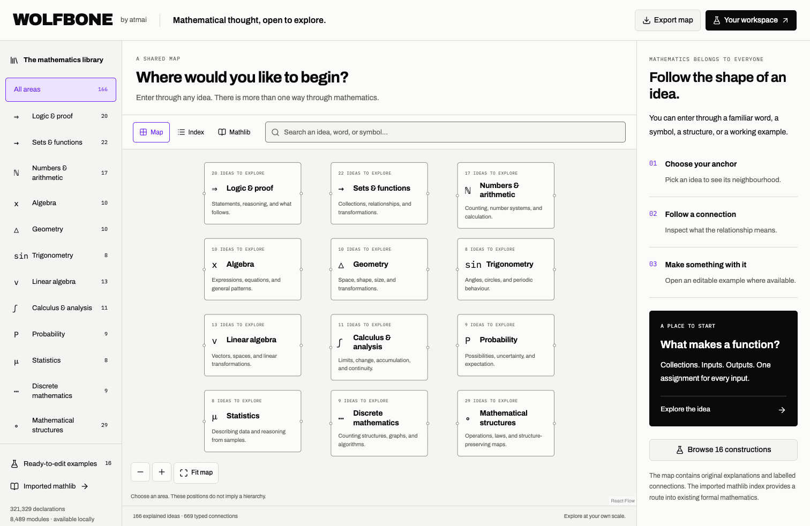
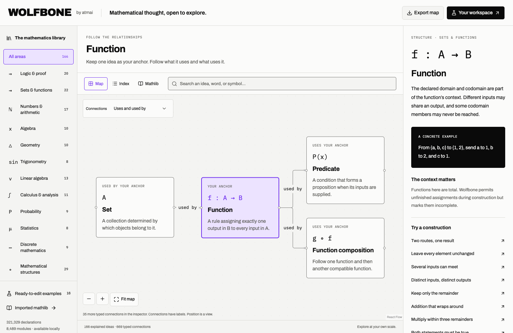
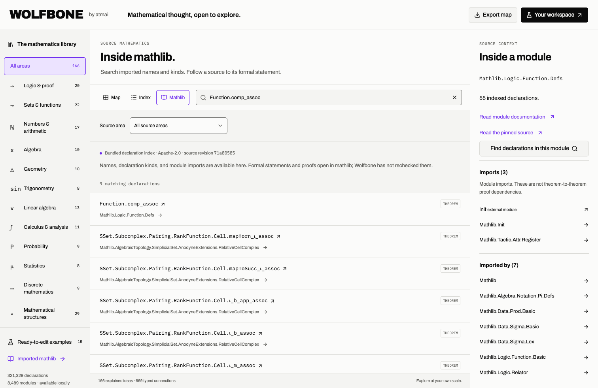
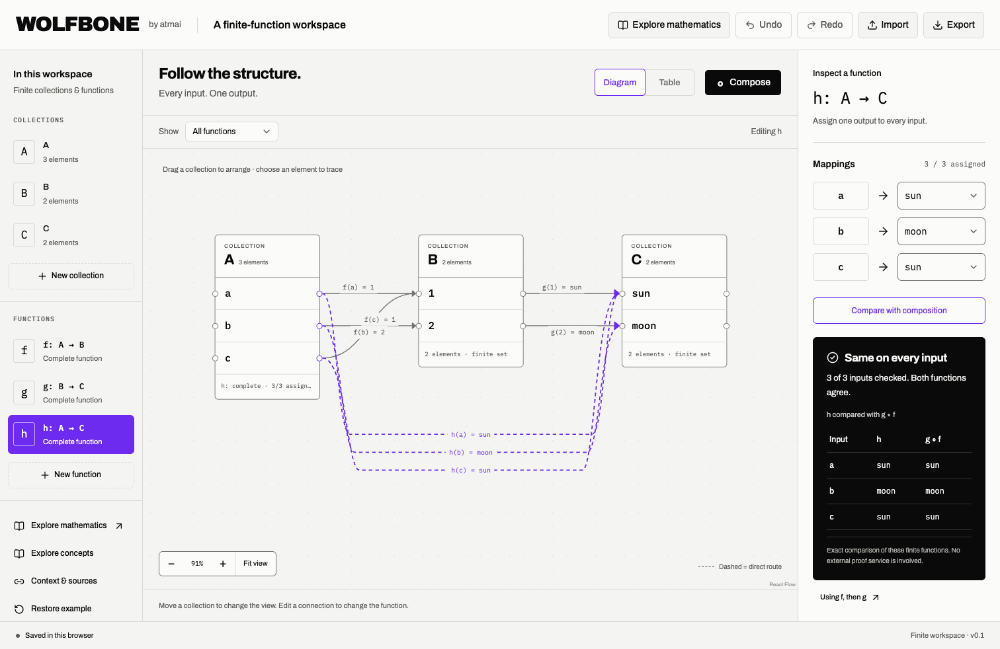

# Wolfbone in use

These are unaltered browser screenshots of the working application, captured on 7 September 2026 from application revision `1348908c8fb98c5d3bcb7035b79754d7978af82e`. Each image is 1512 × 982 pixels. They use original built-in example data in an isolated browser session and contain no personal workspace data or browser chrome.

The [capture manifest](screenshots.json) records the application revision, route, state description, dimensions, browser, capture time, and SHA-256 for each image. Screenshots document visible states; the [browser verification record](../verification/0002-preconfigured-mathematics.md) records tested interactions.

[Back to the project →](../../README.md)

## Start with the whole map

Twelve mathematical areas provide entry points. The adjacent index and inspector offer ways to navigate the same ideas without relying only on spatial position.

## Make one idea your anchor

The Function view shows a selected concept, a bounded neighbourhood of labelled relationships, and ordinary-language context beside notation. Other relationships remain in the inspector and can be selected through the connection perspective control.

## Inspect the source mathematics

Searching for `Function.comp_assoc` returns actual records from the local mathlib metadata snapshot. The module inspector distinguishes direct imports from proof dependencies and provides both documentation and immutable source-file links.

## Construct and compare

The initial finite example sends every input along both a direct route and a composed route. In this state, their outputs agree on all three inputs.

## Find a concrete disagreement

Changing the direct assignment for `a` to `moon` changes the function. The composed route still reaches `sun`, so `a` witnesses a disagreement.

## Updating the images

Capture the actual production build in a fresh browser context using the same dimensions. Wait for local fonts and the diagram layout to settle. Use the built-in examples, exercise the indicated controls, and capture the viewport without browser chrome. Update the image descriptions and manifest together when the corresponding interface changes.

The screenshots accompany Wolfbone's MIT-licensed original project documentation. Visible third-party components retain the terms and attribution listed in [third-party notices](../../THIRD_PARTY_NOTICES.md).
